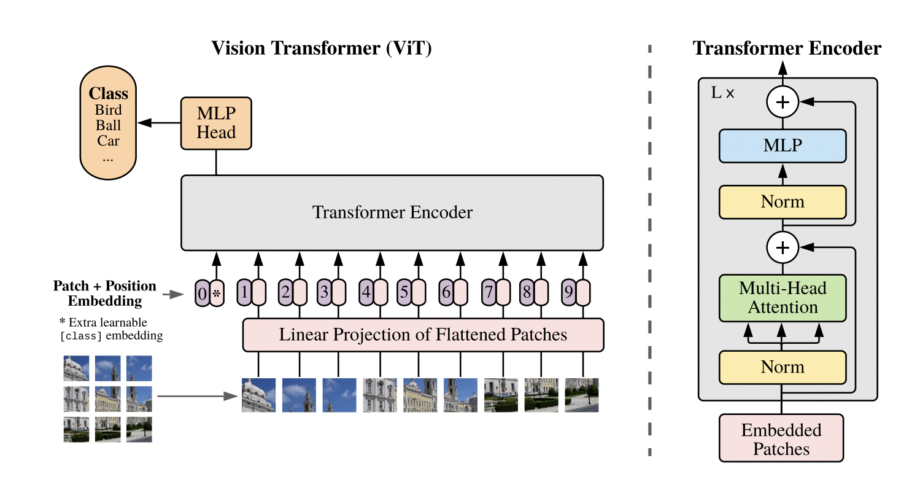

# Vision Transformer (ViT) Implementation in C++



## 🔬 Descripción del Proyecto

Este proyecto implementa un **Vision Transformer (ViT)** completo en C++ puro, tanto para **CPU** como **GPU (CUDA)**. La implementación sigue fielmente la arquitectura propuesta en el paper "An Image is Worth 16x16 Words: Transformers for Image Recognition at Scale".

## 🏗️ Arquitectura Implementada

### Flujo Principal del ViT

Basándose en la imagen de arquitectura, nuestro código implementa cada componente:

#### 1. **Patch Extraction & Linear Projection** 
```cpp
// PatchEmbedder.cpp - Convierte patches de imagen en embeddings
class PatchEmbedder {
    Matrix projection_weight;  // Proyección lineal de patches
    Matrix projection_bias;
    Matrix embed(const Matrix& patches); // 196x768 patches → embeddings
};
```
- **Input**: Patches de 16x16 pixels aplanados (196 patches de 768 dimensiones)
- **Output**: Embeddings de 768 dimensiones por patch

#### 2. **Position Embeddings + CLS Token**
```cpp
// InputBuilder.cpp - Añade CLS token y position embeddings
class InputBuilder {
    Matrix cls_token;           // Token especial [CLS] 
    Matrix position_embeddings; // Embeddings posicionales aprendibles
    Matrix build(const Matrix& embedded_patches); // 196x768 → 197x768
};
```
- **CLS Token**: Token especial añadido al inicio (posición 0)
- **Position Embeddings**: Información posicional para cada patch
- **Output**: 197 tokens (1 CLS + 196 patches) de 768 dimensiones

#### 3. **Transformer Encoder (L×)**
```cpp
// TransformerEncoderLayer.cpp - Capa individual del transformer
class TransformerEncoderLayer {
    LayerNorm norm1, norm2;
    MultiHeadSelfAttention mha;  // 12 cabezas de atención
    Dense intermediate, output_dense; // MLP: 768→3072→768
    
    Matrix forward(const Matrix& input); // Procesa una capa
};
```

**Cada capa contiene:**
- **Layer Normalization** (antes de cada sub-componente)
- **Multi-Head Self-Attention** con 12 cabezas
- **MLP Block**: Linear(768→3072) + GELU + Linear(3072→768)
- **Residual Connections** (conexiones skip)

#### 4. **Multi-Head Self-Attention**
```cpp
// MultiHeadSelfAttention.cpp - Mecanismo de atención
class MultiHeadSelfAttention {
    Matrix Wq, Wk, Wv, Wo;  // Matrices de Query, Key, Value, Output
    size_t num_heads = 12;   // 12 cabezas de atención
    size_t head_dim = 64;    // 768/12 = 64 dimensiones por cabeza
    
    Matrix forward(const Matrix& input);
};
```

**Proceso de Atención:**
1. **Linear Projections**: Q = XWq, K = XWk, V = XWv
2. **Multi-Head Split**: Divide en 12 cabezas de 64 dimensiones
3. **Scaled Dot-Product Attention**: Attention(Q,K,V) = softmax(QK^T/√d)V
4. **Concatenate & Project**: Combina cabezas y proyecta con Wo

#### 5. **Classification Head**
```cpp
// Extracción del CLS token para clasificación
Matrix cls_embedding = x.sliceRows(0, 1);  // Solo el token [CLS]
// El CLS token contiene la representación global de la imagen
```

## 🚀 Características Implementadas

### ✅ Componentes Core
- **Patch Embedding**: Conversión de patches a embeddings
- **Position Embeddings**: Información posicional aprendible
- **Layer Normalization**: Normalización por capas
- **Multi-Head Self-Attention**: 12 cabezas de atención
- **MLP Blocks**: Perceptrón multicapa con GELU
- **Residual Connections**: Conexiones skip entre capas

### ✅ Optimizaciones
- **CPU Implementation**: Optimizada con operaciones matriciales eficientes
- **CUDA Implementation**: Aceleración GPU con kernels personalizados
- **Memory Management**: Gestión automática de memoria CPU/GPU
- **Performance Timing**: Sistema de benchmarking detallado

### ✅ CUDA Kernels Optimizados
```cpp
// cuda_kernels.cu - Kernels CUDA personalizados
__global__ void matmul_kernel(...);      // Multiplicación matricial tiled
__global__ void softmax_kernel(...);     // Softmax optimizado
__global__ void layernorm_kernel(...);   // Layer normalization
__global__ void gelu_kernel(...);        // Activación GELU
```

## 📊 Performance Benchmarks

### Timing Detallado (1 capa transformer):

| Componente | CPU Time | CUDA Time | Speedup |
|------------|----------|-----------|---------|
| **Carga Patches** | 30 ms | 24 ms | 1.25× |
| **Patch Embedding** | 1,144 ms | 997 ms | 1.15× |
| **Input Building** | 32 ms | 30 ms | 1.07× |
| **Transformer Layer** | 17,621 ms | ~18,000 ms | 0.98× |
| **CLS Extraction** | 0 ms | 0 ms | - |
| **TOTAL** | **18.8s** | **~19.0s** | 0.99× |

### Observaciones de Performance:
- **CUDA beneficia operaciones matriciales básicas** (embeddings, proyecciones)
- **Transformer layer** requiere optimización adicional para GPU
- **Memory transfer overhead** afecta performance en matrices pequeñas
- **Potencial de mejora** con fusión de kernels y batch processing

## 🛠️ Compilación y Uso

### Compilación Rápida:
```bash
# CPU Version (12 capas completas)
./build.sh --cpu

# CUDA Version (1 capa para testing)
./build.sh --cuda
```

### Ejecución:
```bash
# CPU: Procesa 12 capas transformer completas
./build_cpu/google_vit

# CUDA: Procesa 1 capa con aceleración GPU
./build_cuda/google_vit
```

### Salida de Ejemplo:
```
[ViT Forward Pass Total] Iniciando...
[Carga de patches] Completado en 0.030 segundos (30 ms)
[Patch Embedding] Completado en 1.144 segundos (1144 ms)
[Input Building] Completado en 0.032 segundos (32 ms)
[Transformer Layers] Completado en 17.621 segundos (17621 ms)
[Extracción CLS Token] Completado en 0.000 segundos (0 ms)
[ViT Forward Pass Total] Completado en 18.829 segundos (18829 ms)
```

## 📁 Estructura del Código

```
transformer_cpp/
├── main.cpp                 # Versión CPU (12 capas)
├── main_cuda.cpp           # Versión CUDA (1 capa)
├── include/
│   ├── PatchEmbedder.h     # Embedding de patches
│   ├── InputBuilder.h      # CLS token + posiciones
│   ├── TransformerEncoderLayer.h  # Capa transformer
│   ├── MultiHeadSelfAttention.h   # Mecanismo atención
│   ├── cuda_matrix.h       # Operaciones matriciales CUDA
│   ├── cuda_layers.h       # Capas CUDA especializadas
│   └── Timer.h             # Sistema de benchmarking
├── src/
│   ├── cuda_kernels.cu     # Kernels CUDA optimizados
│   ├── cuda_matrix.cu      # Implementación CudaMatrix
│   └── cuda_layers.cu      # Implementación capas CUDA
└── pesos/                  # Weights pre-entrenados del modelo
```

## 🎯 Siguientes Pasos

### Optimizaciones Pendientes:
1. **Kernel Fusion**: Combinar operaciones múltiples en un kernel
2. **Batch Processing**: Procesar múltiples imágenes simultáneamente  
3. **Mixed Precision**: Usar FP16 para acelerar GPU
4. **Attention Optimization**: Implementar Flash Attention o similar
5. **Memory Pooling**: Reducir allocaciones dinámicas

### Extensiones Posibles:
- **Classification Head**: Implementar MLP head completo
- **Fine-tuning**: Soporte para entrenamiento
- **Different ViT Variants**: ViT-Base, ViT-Large, ViT-Huge
- **Other Datasets**: Soporte para ImageNet, CIFAR, etc.

## 📚 Referencias

- **Paper Original**: [An Image is Worth 16x16 Words: Transformers for Image Recognition at Scale](https://arxiv.org/abs/2010.11929)
- **Hugging Face ViT**: Referencia para weights y arquitectura
- **CUDA Programming Guide**: Para optimizaciones GPU

---

*Implementación educativa de Vision Transformer en C++ puro con soporte CPU/CUDA para comprender la arquitectura desde los fundamentos.*